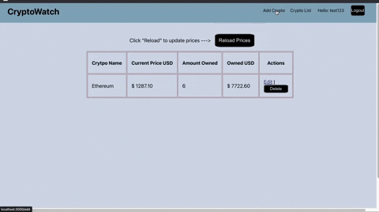

# CryptoTrack
Crypto Price tracking Web App that utilizes CoinGecko API
This project was built using the MERN Stack.

## How it Works

The app connects to CoinGecko API to have a list of all available cryptocurrencies.

User creates profile and adds cryptocurrencies to track.

Profile page shows list of added cryptocurrencies and their current price stored in database.

Whenever user presses reload, the prices are updated based on real time prices.
